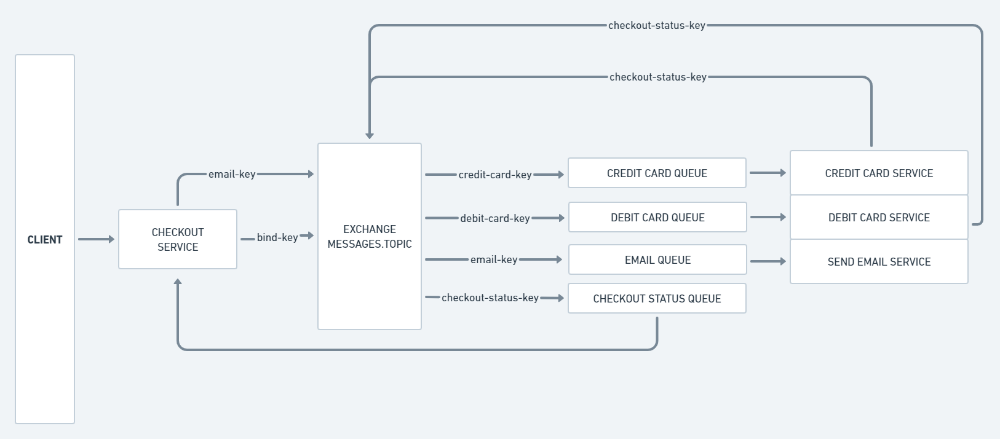

<h1 align="center">
  RabbitMQ - Spring Boot Services
</h1>

<p align="center">
  <a href="#concept">Concept</a>&nbsp;&nbsp;|&nbsp;&nbsp;
  <a href="#routes">Routes</a>&nbsp;&nbsp;|&nbsp;&nbsp;
  <a href="#documentation">Documentation</a>&nbsp;&nbsp;|&nbsp;&nbsp;
  <a href="#technologies">Technologies</a>&nbsp;&nbsp;|&nbsp;&nbsp;
  <a href="#building">Building</a>&nbsp;&nbsp;|&nbsp;&nbsp;
  <a href="#docker">Docker</a>&nbsp;&nbsp;|&nbsp;&nbsp;
  <a href="#contributing">Contributing</a>
</p>


## Concept



## Routes
| Method | URL | Description |
|--------|-----|-------------|
|        |     |             |


## Documentation
| URL | Description |
|-----|-------------|
|     |             |


## Technologies
This project was developed using the following technologies:
- [Spring Boot](https://spring.io/)
- [Spring Data JPA](https://spring.io/projects/spring-data-jpa)
- [MYSQL](https://www.mysql.com/)


## Building
You'll need [Java 11+](https://www.oracle.com/br/java/technologies/javase-jdk11-downloads.html) and [Maven](https://maven.apache.org/download.cgi) installed on your computer in order to build this app.
```bash
$ git clone https://github.com/eric-souzams/rabbitmq-spring-services.git
$ cd rabbitmq-spring-services

$ cd {service-name}
$ mvn install

after install all applications
$ cd {service-name}
$ mvn spring-boot:run
```


## Docker
You'll need [Docker](https://www.docker.com/) installed on your computer in order to build this app.
```bash
$ git clone https://github.com/eric-souzams/rabbitmq-spring-services.git
$ cd rabbitmq-spring-services
$ docker-compose up
```


## Contributing
This repository is currently under development. If you want to contribute please fork the repository and get your hands dirty, and make the changes as you'd like and submit the Pull request.